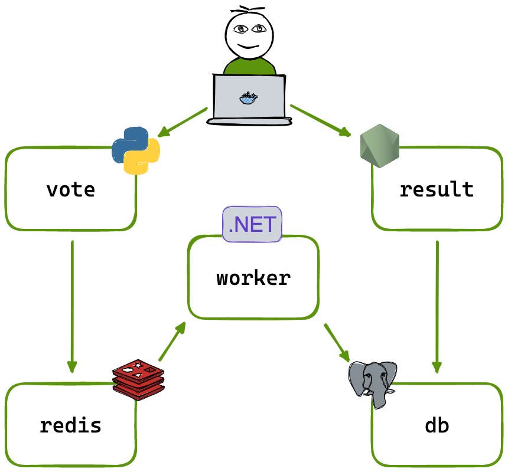

# Example Voting App

A simple distributed application running across multiple Docker containers.

(note) This documentation is altered from the original public release and
includes some comments which is based on the changes made to the application
for the purpose of the demo to the Home Technical Challenge.

## DISCLAIMER 
The changes to the original release are as the followings:
- Use of the docker image published by luizcarloskazuyukifukaya (Kazuyuki
  Fukaya)
- Helm Charts support so the application can be installed with helm command

The following aspect for the enhancement of the microservices architecture are
not included in the application design/implementation/release:
- statefull services (database) high availability - in the current
  implementation, the database data lifecycle is not managed separatly from the pod that host the database service itself. Thus, when updating the application, the data is lost. Database data persistance design should be incorporated into the design so the application can be updated with the data being persistent.
- Application Update - When updating the application, it is important to
  consider deployment with Blue Green or/and Canary deployment, but the current
  proposed CI/CD flow is not including the details on how this can be achieved.
  This details is to be considered for future implementation.

(note) It is highly recommended to follow the best practices for microservices
architecture proposed by Martin Fowler. Please refer to the [Microservices
Guide](https://martinfowler.com/microservices/) for more details.


## Getting started

Download [Docker Desktop](https://www.docker.com/products/docker-desktop) for Mac or Windows. [Docker Compose](https://docs.docker.com/compose) will be automatically installed. On Linux, make sure you have the latest version of [Compose](https://docs.docker.com/compose/install/).

This solution uses Python, Node.js, .NET, with Redis for messaging and Postgres for storage.

Run in this directory to build and run the app:

```shell
docker compose up
```

The `vote` app will be running at [http://localhost:5000](http://localhost:5000), and the `results` will be at [http://localhost:5001](http://localhost:5001).

Alternately, if you want to run it on a [Docker Swarm](https://docs.docker.com/engine/swarm/), first make sure you have a swarm. If you don't, run:

```shell
docker swarm init
```

Once you have your swarm, in this directory run:

```shell
docker stack deploy --compose-file docker-stack.yml vote
```

## Run the app in Kubernetes

The folder k8s-specifications contains the YAML specifications of the Voting App's services.

Run the following command to create the deployments and services. Note it will create these resources in your current namespace (`default` if you haven't changed it.)

```shell
kubectl create -f k8s-specifications/
```

The `vote` web app is then available on port 31000 on each host of the cluster, the `result` web app is available on port 31001.

To remove them, run:

```shell
kubectl delete -f k8s-specifications/
```
## Deploying the app with Jenkins on GKE

Jenkins support deployment on Google Kubernetes Engine (GKE) with the [Google Kubernetes Engine Plugin](https://plugins.jenkins.io/google-kubernetes-engine/). Following the instrucution provided, there is a Jenkinsfile created to demonstrate the deployment of the target application with Jenkins on GKE. Please check the jenkins/gcp-gke.jenkinsfile for the actual steps performed by Jenkins.

## Architecture



* A front-end web app in [Python](/vote) which lets you vote between two options
* A [Redis](https://hub.docker.com/_/redis/) which collects new votes
* A [.NET](/worker/) worker which consumes votes and stores them in…
* A [Postgres](https://hub.docker.com/_/postgres/) database backed by a Docker volume
* A [Node.js](/result) web app which shows the results of the voting in real time

## Notes

This project has been modified from the original with the following supports:
1) Helm Chart package
  
  helm folder is added with the required YAML and other dependents files
  altered for this demo

2) kubernetes namespace creation and installation of Helm Chart
  
  An shell script is added to perform these task so the Helm Chart is installed
  to the target kubernetes cluster. Still you need to configure the CLI so you
  can execute the kubectl commands.

The voting application only accepts one vote per client browser. It does not register additional votes if a vote has already been submitted from a client.

This isn't an example of a properly architected perfectly designed distributed app... it's just a simple example of the various types of pieces and languages you might see (queues, persistent data, etc), and how to deal with them in Docker at a basic level.
