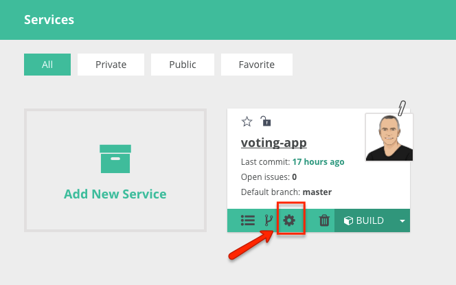
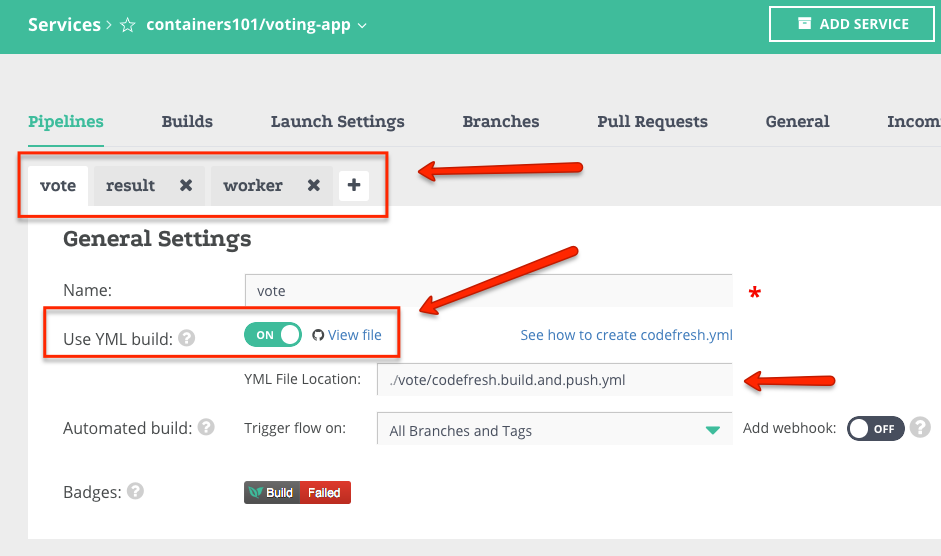
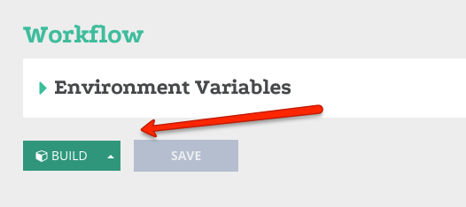
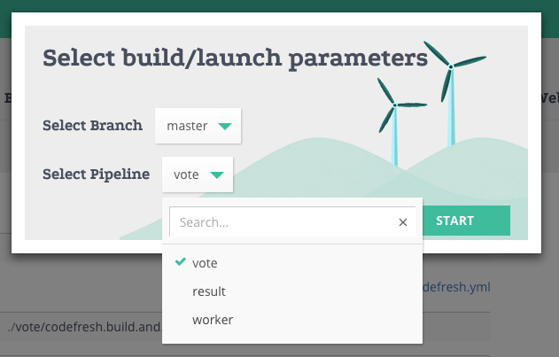
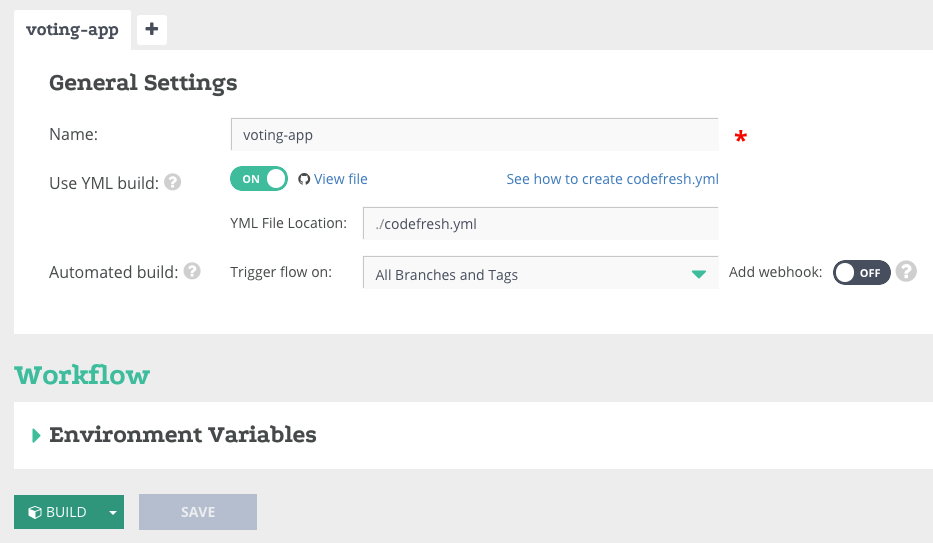

Voting App -> Behalf Demo
==========

-------------

this application is based on Docker's example [voting app](https://github.com/docker/example-voting-app). 

--------------------

Architecture
------------

* A Python webapp which lets you vote between two options
* A Redis queue which collects new votes
* A .NET worker which consumes votes and stores them in…
* A Postgres database backed by a Docker volume
* A Node.js webapp which shows the results of the voting in real time

Getting started
---------------
####*Perquisites:*
1. Fork this repository. 
2. Add this repository to your Codefresh account.
3. Set your Docker registry (Docker Hub, GCR etc.) in your account admin. This is in case you want to push.

(If you don't want to set the credentials in the admin or want to use a different credentials see example `push.with.credentials.yml` in the `vote` folder.)

####*Build and Push each service separately:*

1. Go to The Service settings 

2. Create 3 services: *vote*, *result* and *worker*. 
3. Set each service's `Use YML build` property to `ON`. Optional: set `Add webhooks` to on. This will trigger build on every commit.
4. Set the YML location to `./vote/codefresh.build.and.push.yml` for the `vote` service. Do the same for each one of the other services, and just change the `vote` to `result` or `worker`.

5. You can now press Build for each one of the pipelines that you want. Just select which one on the dropdown.

 
 
####*Build and Push all the services:*
If you want to create on build for all the services you can just add one service with a yaml that will build all of them.

1. Go to The Service settings 

2. Create only one service 
3. Set service's `Use YML build` property to `ON`. 
4. Set the YML location to `./codefresh.yml`.
5. You can now press Build and build your service.

