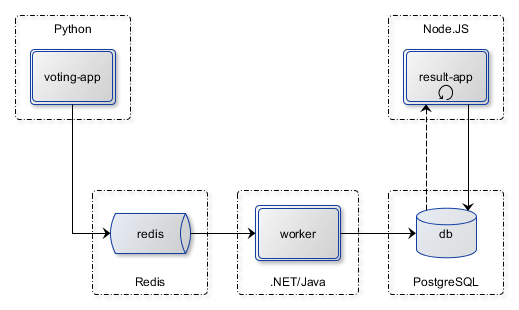

Example Voting App
=========

A simple distributed application running across multiple Docker containers.

Getting started
---------------

Download [Docker Desktop](https://www.docker.com/products/docker-desktop) for Mac or Windows. [Docker Compose](https://docs.docker.com/compose) will be automatically installed. On Linux, make sure you have the latest version of [Compose](https://docs.docker.com/compose/install/). 


## Linux Containers

The Linux stack uses Python, Node.js, .NET Core (or optionally Java), with Redis for messaging and Postgres for storage.

> If you're using [Docker Desktop on Windows](https://store.docker.com/editions/community/docker-ce-desktop-windows), you can run the Linux version by [switching to Linux containers](https://docs.docker.com/docker-for-windows/#switch-between-windows-and-linux-containers), or run the Windows containers version.

Run in this directory:
```
docker-compose up
```
The app will be running at [http://localhost:5000](http://localhost:5000), and the results will be at [http://localhost:5001](http://localhost:5001).

Alternately, if you want to run it on a [Docker Swarm](https://docs.docker.com/engine/swarm/), first make sure you have a swarm. If you don't, run:
```
docker swarm init
```
Once you have your swarm, in this directory run:
```
docker stack deploy --compose-file docker-stack.yml vote
```

## Windows Containers

An alternative version of the app uses Windows containers based on Nano Server. This stack runs on .NET Core, using [NATS](https://nats.io) for messaging and [TiDB](https://github.com/pingcap/tidb) for storage.

You can build from source using:

```
docker-compose -f docker-compose-windows.yml build
```

Then run the app using:

```
docker-compose -f docker-compose-windows.yml up -d
```

> Or in a Windows swarm, run `docker stack deploy -c docker-stack-windows.yml vote`

The app will be running at [http://localhost:5000](http://localhost:5000), and the results will be at [http://localhost:5001](http://localhost:5001).


Run the app in Kubernetes
-------------------------

The folder k8s-specifications contains the yaml specifications of the Voting App's services.

First create the vote namespace

```
$ kubectl create namespace vote
```

Run the following command to create the deployments and services objects:
```
$ kubectl create -f k8s-specifications/
deployment "db" created
service "db" created
deployment "redis" created
service "redis" created
deployment "result" created
service "result" created
deployment "vote" created
service "vote" created
deployment "worker" created
```

The vote interface is then available on port 31000 on each host of the cluster, the result one is available on port 31001.

Architecture
-----



* A front-end web app in [Python](/vote) or [ASP.NET Core](/vote/dotnet) which lets you vote between two options
* A [Redis](https://hub.docker.com/_/redis/) or [NATS](https://hub.docker.com/_/nats/) queue which collects new votes
* A [.NET Core](/worker/src/Worker), [Java](/worker/src/main) or [.NET Core 2.1](/worker/dotnet) worker which consumes votes and stores them in…
* A [Postgres](https://hub.docker.com/_/postgres/) or [TiDB](https://hub.docker.com/r/dockersamples/tidb/tags/) database backed by a Docker volume
* A [Node.js](/result) or [ASP.NET Core SignalR](/result/dotnet) webapp which shows the results of the voting in real time


Note
----

The voting application only accepts one vote per client. It does not register votes if a vote has already been submitted from a client.
